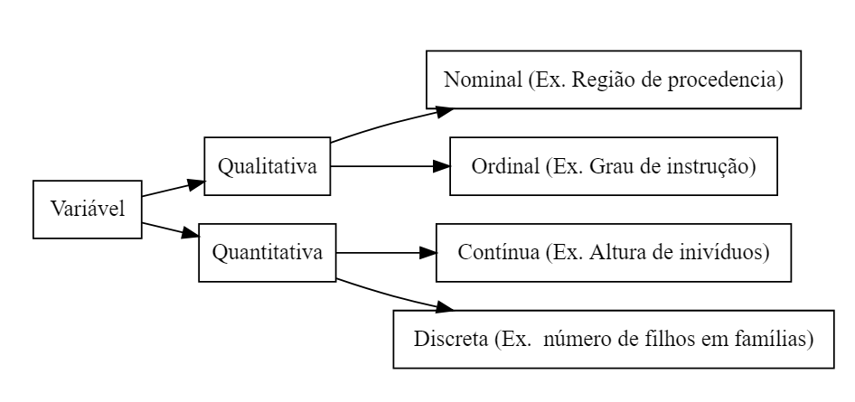

--- 
title: "Estatística Descritiva"
author: "Rosineide da Paz "
date: "`r format(Sys.time(), '%d-%m-%Y')`"
site: bookdown::bookdown_site
documentclass: book
bibliography: [references.bib, refpack.bib]
biblio-style: apalike
link-citations: yes
fig_caption: yes
---


# Análise Exploratória  dos Dados


Em qualquer análise estatística, deve-se, inicialmente, realizar uma análise exploratória dos dados, isso pode ser feito usando  ferramentas da __Estatística Descritiva__. Nessa etapa da análise, procura-se obter a maior quantidade possível de informações a partir dos dados observados. Se a análise é realizada tendo como base uma amostra da população de interesse, é nessa fase que são obtidas as informações que podem dar ideia sobre qual modelo probabilístico pode descrever melhor o fenômeno investigado, assim pode-se ter uma ideia do modelo a ser utilizado na fase posterior da análise.


```{r eval=FALSE, include=FALSE}
# automatically create a bib database for R packages
knitr::write_bib(c(
  .packages(),'DiagrammeR' ,'bookdown', 'knitr', 'rmarkdown'
), 'packages.bib')
```


## Variável {#variavel}


Os dados são observações de  fenômeno de interesse,  a esses fenômenos damos o nome de __variável__. Assim, uma variável  é um  atributo, cujo valor pode variar de uma unidade de investigação para outra.  Por exemplo, as unidades podem ser pessoas contaminadas por um vírus e a variável o tempo de recuperação após  um determinado tipo de tratamento ser iniciado. Nesse caso, espera-se que o tempo de recuperação varie entre os indivíduos, ou unidades amostrais.

 Uma observação, ou resposta, é o valor assumido por uma variável em uma das unidades investigadas. A observação da variável em várias unidades dá origem aos dados observados.
 

```{example eval=FALSE, include=FALSE}
Um algoritmo pode ser executado para realizar a multiplicação de duas matrizes. Suponha que se deseja analisar a quantidade de tempo extra necessária para aumentar a matriz em uma dimensão, começando por duas matrizes $1 \times 1$, dois escalares iguais, em seguida para duas matrizes $2 \times 2$, duas matrizes de dimensão 2, iguais e composta pelo mesmo escalar adotado no inicio, e assim sucessivamente. 

- __População__: todas as possíveis execuções do algoritmo para estas matrizes.
- __Variável__: tempo de execução do algoritmo nestas situações.
- __Unidades amostrais__: medidas repetidas na mesma unidade?
		
		
```


```{example}
Exemplos de variáveis.
```

		
- tempo de execução de um algoritmo em diferentes máquinas;
- rendimento das famílias de uma grande cidade;
- número de erros em pacotes de dados enviados por um servidor;
- número de clientes com a mesma dúvida em um site de suporte durante um período de tempo;
- opinião dos consumidores de um determinado produto (péssimo, regular, ótimo etc).

### Tipos de Variáveis


Podemos classificar variáveis em qualitativas e quantitativas. As variáveis  __qualitativas__ têm seus valores  expressos por atributos, exprimindo alguma qualidade.


As variáveis qualitativa podem ainda ser classificadas como __nominais__ ou __ordinais__.

Uma variável é nominal se os atributos que esta representa não têm uma ordenação, por exemplo, cor de cabelo, sexo de indivíduos etc, enquanto que as variáeis ordinais exprimem alguma ordenação, como por exemplo, opinião sobre a qualidade de um produto (péssimo, regular, ótimo). 


As variáveis _quantitativas_ exprimem quantidades ou mensurações. Essas variáveis também podem ser classificadas em  __contínuas__ e __discretas__. 

Variável  discreta  assume valores em um conjunto enumerável (ou contável),  por exemplo, número de carros que passam por um posto de pedágio em um intervalo de tempo. 


Uma variável é contínua quando assume valores em um conjunto não-enumerável, ou seja, em um intervalo da reta,  por exemplo, alturas de pessoas em um determinado povoado.  Veja um resumo dos tipos de variáveis no diagrama apresentado na Figura \@ref(fig:diagram), criado com o uso do pacote [@R-DiagrammeR]. 


```{r eval=FALSE, include=FALSE}
DiagrammeR::grViz("digraph{
  graph [layout = dot, rankdir = LR]
  
  node [shape = rectangle]        
  rec1 [label = 'Variável']
  rec2 [label = 'Qualitativa']
  rec3 [label =  'Quantitativa']
  rec4 [label = 'Contínua (Ex. Altura de inivíduos)']
  rec5 [label = 'Discreta (Ex.  número de filhos em famílias)']
  rec6 [label = 'Nominal (Ex. Região de procedencia)']
  rec7 [label = 'Ordinal (Ex. Grau de instrução)']
  
  ## definitions
  rec1 -> rec2 -> rec6;
  rec2 -> rec7;
  rec1 -> rec3 -> rec4;
  rec3 -> rec5;
     }", 
  height = 500)

```


```{r diagram, echo=FALSE, fig.cap=": Classificação de vaiáveis.", out.width="90%"}

```


Note que,  na prática, em geral variáveis quantitativas contínuas são resultados de mensurações, enquanto  variáveis quantitativas discretas são resultados de contagens. Portanto, para entender a natureza de uma variável, e classifica-la corretamente, deve-se entender o processo que a originou.


## Escala de Likert para variáveis qualitativas

Variáveis qualitativas muitas vezes podem ser observadas usando a escala de Likert [@allen2007likert]. Essa escala pode ser uma boa alternativa aos dados categóricos, pois permite o uso de tecnicas para analise que não seriam possíveis de serem utilizadas em dados categóricos.

Essa escala é principalmente utilizada em questionários para obter as preferências ou o grau de concordância do entrevistado com uma declaração ou conjunto de declarações. Essa é  uma técnica de escala em que os entrevistados são solicitados a indicar seu nível de concordância com uma determinada declaração por meio de uma escala ordinal ou intervalar.


```{example}
Como um exemplo de variável que pode ser observada em uma escala Likert, suponha que é desejado saber o quanto um cliente está satisfeito com um atendimento. Neste caso, pode-se perguntar:
  
  em uma escala de 0 até 5, em que zero signigica muito insatisfeito e 5 muito satisfeito, qual é o seu grau de satisfação com esse atendimento?
  
  Para essa pergunta pode-se estabelecer valores intermediários (1, 2, 3 e 4), ou usar o intervalo de 0 até 5, em que a pessoa possa escolher qualquer valor no intervalo [0,5].


```


